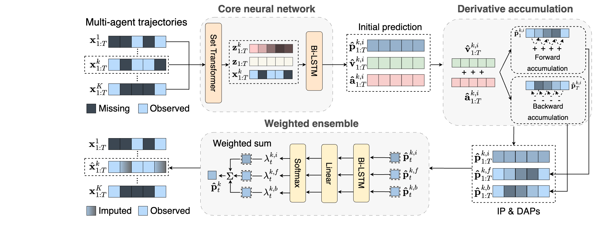

<div align="center">
	<h1>
		MIDAS
	</h1>
</div>
The code corresponding to the paper “Trajectory Imputation in Multi-Agent Sports with
Derivative-Accumulating Self-Ensemble"

The code is written with PyTorch v1.10.1 (Python 3.8.18).

<!-- Please note that due to size limitations, we couldn't upload the data files. If our paper is accepted, we will upload all the data files. -->

<br>

## Setup
1. **Install the `requirements.txt` file using the following command:**

    ```bash
    $ pip install -r requirements.txt
    ```
## Running the Code
1. **Training**
    Run the following .sh file to train our proposed MIDAS model on soccer dataset:
   
    ```bash
    $ sh scripts/midas_soccer.sh
    ```
    
2. **Evaluating**
    
    Run the `model_eval.ipynb` code to evaluate trained model performance.

